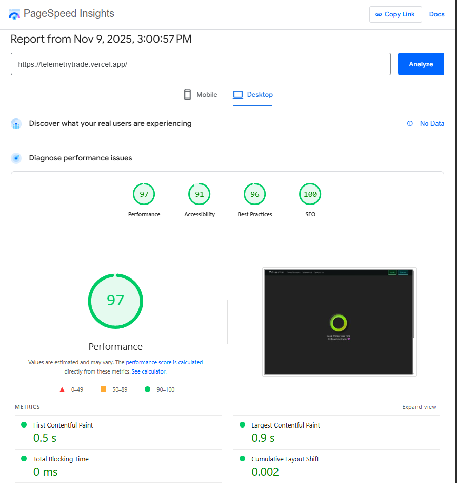

# 🚀 TelemetryTrade | High-Performance Token Trading Interface

TelemetryTrade is a modern, high-performance web trading interface designed to show real-time price movement of crypto tokens. Engineered Trade Token Discovery Table and built to meet the demanding standards of low-latency traders, the project is architected with strict performance, scalability, and accessibility principles in mind.

## ✨ Features

* Avoided Next.js 15 due to React 19 conflicts; using stable Next.js 14
* Added TypeScript, ESLint, TailwindCSS, and `src/` directory structure
* Implemented App Router with `@/*` alias support
* Added delayed loader for improved UX
* Installed dependencies: `react-icons`, `framer-motion`
* Built responsive sticky navbar using `navLinks.json`
* Created interactive responsive footer using `footLinks.json`
* Integrated newsletter form with MailService + NewsletterService APIs
* Stored subscribed users in `mailUsers.json`
* `.env` added to `.gitignore` for security
* Added favicon and web manifest
* Added custom fonts: `--font-satoshi`, `--font-rubik-80s`
* Integrated shadcn/ui design system
* Implemented Skeleton Loading UI + Shimmer state
* Built responsive Hero Section
* Added Clerk secure multi-auth (email + wallets)
* Responsive Navbar with Mobile Menu
* Responsive Footer with Newsletter Section
* Installed `@tanstack/react-query` for data fetching and caching
* Installed `recharts` for visual charts
* Added `lucide-react` for modern icons
* Installed `tailwindcss-animate`, `class-variance-authority`, `clsx`, `tailwind-merge`
* Built Token Discovery table with CoinGecko data, sparkline, and auto-refresh
* Added null-safe formatters and error UI in Token Table
* Used custom SVG sparkline with zero chart dependencies
* Optimized sparkline with `useMemo` and pure functions
* Added sorting, searching, filtering, and pagination to the Token Table
* Added currency switcher (USD/INR) with formatting
* Added table density toggle (compact/comfortable)
* Added pagination controls and footer with range display
* Added manual Refresh button and last update timestamp
* Implemented advanced sparkline with hover, tooltip, and area fill
* Added client-side Gemini chat API integration
* Built Gemini-powered Crypto Chatbot UI
* Added marketing header and disclaimers in Chat UI
* Created responsive Contact Us page with API integration and validation
* Added dark-themed global 404 page with quick navigation links
* Integrated TradingView-based CryptoChart with search and fullscreen
* Implemented 7-day sparkline modal using Recharts with stats and currency switch
* Built dark-themed TradingView candlestick widget with quick-pick and fullscreen
* Added dark-themed Terms & Conditions page with scrollspy navigation
* Enabled sticky header and active anchor highlighting for Terms page
* Ensured no metadata export in client Terms file to avoid Next.js issue
* Added links to `/privacy`, `/disclosures`, and legal email in Terms page
* Ensured dark/light mode support and semantic markup across the app
* Added code comments and clear changelog entries for traceability
* Modern Market Dashboard with real-time updates API
* Fully responsive down to 320px width
* Animated row deltas (green/red transitions)
* Sortable and filterable token table
* Hover effects and click-based modals
* Skeleton and shimmer loading states
* Progressive data loading
* Virtualized table rows (10k+ items with no lag)
* Lighthouse score ≥ 90 on mobile and desktop
* Connected to real trading APIs
* Optional charts powered by TradingView
* Next.js 14 with TypeScript (strict mode)
* TailwindCSS for styling
* Atomic Design folder structure
* Redux Toolkit and React Query for state and data management
* shadcn/ui + Headless UI components
* Jest + React Testing Library setup
* ESLint and Prettier configured
* SEO-friendly and accessible
* Smooth transitions with Framer Motion
* Token preview charts with Recharts
* Search and deep-link-based filters
* Full keyboard navigation support
* User-configurable columns
* Mail subscription API with MailUser storage
* Responsive sticky navbar and footer
* Custom 404 page with design consistency
* TradingView candlestick and line chart integrations
* Fully typed Contact form with backend API
* AI chatbot powered by Google Gemini
* Chat UI with optimistic updates and streaming
* Dark-themed Terms & Conditions page
* Scrollspy and anchor-based navigation
* Clerk-based multi-auth with wallet + email
* Custom SVG sparkline charts
* Skeleton UI for data fetch
* Currency switcher (USD/INR)
* Live client-side pagination with size controls
* Page number windowing with ellipsis
* Detailed price statistics in chart modals
* Toggleable table density (compact/comfortable)
* Manual and automatic refresh with status badges
* GitHub clean commits and deployment to Vercel
* Optimized folder structure under `/src`
* Web manifest, favicon, and custom Satoshi font
* Error handling panel for API failures
* Loading indicators for async components
* Reusable Button, Card, and Input components
* Utilities with `clsx` and `tailwind-merge`
* Null-safe formatting utilities
* Responsive footer with live newsletter form
* Global `.env` handling with `.gitignore`
* shadcn-based cards, modals, scroll areas
* Global provider setup for state and style
* Multi-column responsive grid layouts
* Placeholder charts with prompt to toggle to live mode
* Future scope: wallet management and deeper live APIs
* Visual regression-compatible markup, test-ready and scalable

---

## Lighthouse Report


---

## 🔥 Extras (Optional Bonus Additions)

- 🎨 Framer motion for smooth animated transitions
- 📊 Token preview charts with Recharts or TradingView widgets
- 🔄 Token state persisted via Zustand or URL params
- ♿ Full keyboard navigation & ARIA roles for accessibility
- 🔍 Search & deep-link filters, user-configurable columns
- 🤖 Deployed on Vercel Optimised

---

## 🌐 Web Fundamentals

- **Frontend**: Next.js 14 (App Router), TypeScript (strict mode), Tailwind CSS
- **State Management**: Redux Toolkit + React Query
- **UI Components**: Radix UI / shadcn/ui / Headless UI
- **Streaming**: WebSocket (Socket.io-client mock)
- **Table**: Virtualized row rendering for 10k+ rows with no lag
- **Performance Tools**: Lighthouse, memoization, lazy-loading
- **Testing**: Jest + React Testing Library
- **Architecture**: Atomic Design (Atoms → Molecules → Organisms → Templates)
- **Styling**: Tailwind, utility-first, no inline styles
- **Documentation**: README, code comments, clean commits

---

## 🛠️ Project Roadmap (24Hours Scope)

```plaintext
📍 PHASE 1 – Setup & Architecture
1. Initialize Next.js + TS project
2. Configure Tailwind, shadcn/ui, ESLint, Prettier
3. Add folder structure (Atomic Design)
4. Setup Redux Toolkit and React Query

📍 PHASE 2 – UI Construction
5. Build pixel-perfect token table
6. Implement tabs: "New Pairs", "Final Stretch", "Migrated"
7. Add sorting, row hover effects, modal on click
8. Build UI with Radix + Tailwind (≤ 2px diff)

📍 PHASE 3 – Real-Time + Loading States
9. Mock WebSocket server to push price updates
10. Smooth animated deltas on price changes
11. Add skeleton, shimmer, progressive loading

📍 PHASE 4 – Performance & Mobile
12. Virtualized table (without layout shifts)
13. Responsive view for 320px (horizontal scroll)
14. Lighthouse score tuning ≥ 90

📍 PHASE 5 – Deliverables
15. Push code to GitHub (clean commits)
16. Deploy app to Vercel (WebSocket fix)
17. Record 1–2mi YouTube demo (public)
18. Finalize README w/ screenshots + architecture
```

---

## 📁 Folder Structure (Atomic Architecture)

```plaintext
TelemetryTrade/
├── .env
├── .eslintrc.json
├── .gitignore
├── components.json
├── next-env.d.ts
├── next.config.mjs
├── package-lock.json
├── package.json
├── postcss.config.mjs
├── README.md
├── tailwind.config.ts
├── tsconfig.json
├── src/
│   ├── app/
│   │   ├── api/
│   │   │   ├── crypto-chat/
│   │   │   │   └── route.ts
│   │   │   ├── sendEmail/
│   │   │   │   └── route.js
│   │   │   └── subscribe/
│   │   │       └── route.js
│   │   ├── ai/
│   │   │   └── page.tsx
│   │   ├── candlestick/
│   │   │   └── page.tsx
│   │   ├── contact/
│   │   │   └── page.tsx
│   │   ├── discovery/
│   │   │   └── page.tsx
│   │   ├── terms/
│   │   │   └── page.tsx
│   │   ├── fonts/
│   │   │   ├── Satoshi-Bold.woff2
│   │   │   ├── Satoshi-Medium.woff2
│   │   │   ├── Satoshi-Regular.woff2
│   │   │   └── Satoshi-Variable.woff2
│   │   ├── icon0.svg
│   │   ├── icon1.png
│   │   ├── layout.tsx
│   │   ├── loading.tsx
│   │   ├── manifest.json
│   │   ├── not-found.tsx
│   │   └── page.tsx
│   ├── components/
│   │   ├── ui/
│   │   │   ├── button.tsx
│   │   │   ├── button1.tsx
│   │   │   ├── card.tsx
│   │   │   ├── input.tsx
│   │   │   ├── light-rays.tsx
│   │   │   ├── scroll-area.tsx
│   │   │   ├── skeleton.tsx
│   │   │   └── wavy-background.tsx
│   │   ├── ChartModal.tsx
│   │   ├── CryptoChatbot.tsx
│   │   ├── CyptoChart.tsx
│   │   ├── DelayedLoader.tsx
│   │   ├── Foot.tsx
│   │   ├── Nav.tsx
│   │   └── SlideChatSidebar.tsx
│   ├── data/
│   │   ├── footLinks.json
│   │   ├── mailUsers.json
│   │   └── navLinks.json
│   ├── lib/
│   │   └── utils.ts
│   ├── middleware.ts
│   └── provider.tsx
├── public/
│   ├── Images/
│   │   └── Logo.png
│   ├── apple-icon.png
│   ├── favicon.ico
│   ├── web-app-manifest-192x192.png
│   └── web-app-manifest-512x512.png
```

---

## 📝 Development Commands

```bash
# Install dependencies
npm install

# Run development server
npm run dev

# Run tests
npm run test

# Lint code
npm run lint

# Build for production
npm run build
```

---

## 🙋‍♂️ Contributing & Support

Clone this repository, install dependencies, and start building! For bug reports or feature suggestions, open an issue on GitHub.

---

## 📜 License

MIT License © 2025 TelemetryTrade

# Developer Notes
- Avoid Next.js 15; its forced jump to React 19 breaks half the ecosystem with dependency conflicts, while Next.js 14 stays rock-solid and production-safe.
  - or if wanna upgrade, use this overrides in config
    ```js
    "packageManager": "npm@10.5.2",
    "overrides": {
    "react": "$react",
    "react-dom": "$react-dom",
    "next": "$next"},
    ```
- Added TypeScript, ESLint, TailwindCSS, and src/ directory structure
- Implemented App Router with alias support for @/*
- Added delayed loader for improved UX
- Installed dependencies: react-icons and framer-motion
- Built responsive sticky navbar (links via navLinks.json)
- Created interactive responsive footer (links via footLinks.json)
- Integrated newsletter form with MailService + NewsletterService APIs
- Stored subscribed user in mailUsers.json
- Added .env to .gitignore for security
- favicon with manifest
- fonts --font-satoshi --font-rubik-80s
- shadcn design system
- Skeleton Loading UI + Shimmer State
- Hero Section responsive
- Clerk secure multiauth with various wallet accounts & mail
- Responsive Navbar with Mobile Menu 
- Responsive Footer with Newsletters Section
- Added @tanstack/react-query for data fetching and caching
- Installed recharts for chart visualizations
- Added lucide-react for icons
- Installed tailwindcss-animate, class-variance-authority, clsx, and tailwind-merge for enhanced styling and utility support
- Token Discovery table with CoinGecko data, null-safety, sparkline, and auto-refresh
  - WHY
    - Needed a compact crypto “discovery” table with real-time market data.
    - Existing UI had no polling, no graceful null handling, and no quick trend insight.
  - WHAT
    - Added Token Discovery page rendering top-20 tokens.
    - Pulled live data from CoinGecko `coins/markets` with sparkline + price % changes.
    - Auto-refresh every 60s + Next revalidate(60) for caching.
    - Graceful null/NaN handling everywhere.
    - SVG sparkline (no chart libs) + min/max hover info.
    - Inline SVG up/down badges for 1h/24h/7d % moves.
    - Skeleton rows shown on load.
    - Dark mode friendly.
    - Semantic table markup.
  - LOGIC & THINKING
    - Data shaped into `Token` interface; numeric fields made `number | null`.
    - `fetchTokens()` throws if `!res.ok`; error surfaced in UI.
    - Minimal state: tokens/error/loading.
    - `useEffect`: initial load + 60s poll with cleanup.
    - Formatters return `-` when num is null/NaN. Prices <1 use higher precision.
    - Percent fields show +/- sign via lightweight badge.
    - Sparkline:
      - Pure SVG; X from index, Y normalized by min/max.
      - Fallback to 2-point flat line if array missing or small.
      - `useMemo` avoids repeated geometry calc.
      - Green if last >= first; else red.
    - Table rows show:
      rank | name/symbol/image | price | 1h% | 24h% | 7d% | sparkline | market cap | volume | circ supply
    - Skeleton rows keep layout stable while loading.
  - API DETAILS
    - CoinGecko endpoint:
      - GET /api/v3/coins/markets
      - vs_currency=usd
      - order=market_cap_desc
      - per_page=20
      - page=1
      - sparkline=true
      - price_change_percentage=1h,24h,7d
      - locale=en
    - Notes:
      - No API key.
      - Missing fields possible → null-safe UI.
      - Rate-limits → combined polling + revalidate to be gentle.
  - EDGE CASES HANDLED
    - API failure → friendly error panel.
    - Null numeric fields → “-”.
    - Missing or tiny sparkline → flat fallback line.
    - range=0 → guard to avoid div-by-zero.
    - Very small price (<$1) → show 6 dp.
  - PERF
    - Inline SVG (no chart deps).
    - `useMemo` for sparkline geometry.
    - Minimal DOM.
  - FUTURE IMPROVEMENTS
    - Sort/filter columns.
    - Currency selector + locale options.
    - Search bar.
    - Retry CTA + jittered poll.
    - Virtualize rows for >50 assets.
  - SECURITY
    - No secrets; only public HTTPS API.
    - No user data stored.
  - CHANGELOG
    - add Token Discovery table
    - add CoinGecko fetch + polling
    - add null-safe formatters
    - add SVG sparkline
    - add loading skeleton + error UI
    - style dark/light modes
- currency switcher, sorting, filtering, density toggle, and interactive sparkline
  - Added currency selector (USD/INR) with dynamic price + compact formatting
  - Expanded API fetch to 100 assets; removed server revalidate, using no-store
  - Implemented live client-side search for name/symbol
  - Added sortable table headers for rank, name, price, pct-changes, mcap, volume, supply
  - Added row-density toggle (comfortable/compact)
  - Added manual data Refresh control + visible timestamps
  - Added status badges (asset count, last update, auto-refresh indicator)
  - Reworked sparkline to include:
    - Area fill + stroke
    - Hover crosshair + marker
    - Tooltip price display (portal)
  - Added lightweight Tooltip/HoverCard system using portals
  - Added PriceChangeBadge w/ semantic intents (success/danger/muted)
  - Improved null/NaN safety across formatting
  - Introduced memoized filtering + sorting pipeline
  - Updated UI: sticky header controls, improved dark styling
- full client-side pagination with page-size control and navigable footer
  - Added pagination state: page + pageSize (25 | 50 | 100)
  - Computed derived values: totalItems, totalPages, pageClamped, startIdx, endIdx
  - Slice filtered dataset into pageData for rendering
  - Added pagination footer with:
    - Page size selector
    - First / Prev / Next / Last buttons
    - Windowed page-number display with ellipsis for large ranges
  - Shows range badge: “Showing X–Y of N”
  - Auto-resets to page 1 when query, sort, density, currency, or pageSize changes
  - Proper disabled states + aria-label/title for navigation buttons
  - Matches table styling (dark mode, borders, hover)
- Gemini + charting deps and env config
  - Installed @google/genai, react-apexcharts, apexcharts, zod
  - Added GEMINI_API_KEY and NODE_ENV to .env.local
- Gemini-powered /api/crypto-chat with CoinGecko snapshot
  - Added POST handler with live market fetch
  - Validates env (GEMINI_API_KEY, COINGECKO_URL)
  - Reduces payload to top 20 fields for prompt
  - Generates concise trading response via gemini-2.0-flash
  - Returns structured JSON output
- TelemetryAI CryptoChatbot UI
  - Added chat UI with model + user roles
  - Integrated POST /api/crypto-chat for responses
  - Added optimistic updates + scroll behavior
  - Includes loading state + Enter-to-send
- TelemetryAI chat page UI
  - Added /chat page with marketing header + disclaimer
  - Integrated CryptoChatbot component layout
  - Responsive two-column design
- Responsive Contact Us page with form validation and API integration
  - Implement two-column responsive layout (stacked on mobile)
  - Add fully typed input and textarea components
  - Connect form to /api/sendEmail endpoint using fetch
  - Include loading state and success/error message handling
- dark-themed global 404 page matching brand design
  - Created app/not-found.tsx with WavyBackground and brand typography
  - Added responsive 404 layout with quick navigation (Home + Discovery)
  - Ensured design consistency with landing page (colors, font, CTA)
- TradingView-based CryptoChart with search & fullscreen
  - Lazy-load TradingView tv.js once with cleanup
  - Manage widget lifecycle via ref; remove old widget on updates/unmount
  - Support custom symbol search (auto-append USD) and quick-pick buttons
  - Show current symbol + friendly name from POPULAR_CRYPTOS
  - Add responsive fullscreen toggle (fixed inset-0) with ESC-style control
  - Light theme, daily interval, autosize, toolbar and legend visible
  - Improve UX with input icon, focus ring, and small-screen layout
- dark-themed 7-day sparkline modal with USD/INR + stats
  - Recharts ComposedChart with dual Y-axes (USD left, INR right), lines + subtle areas
  - Memoized data shaping, min/max/avg + padded dynamic domains
  - Currency-aware tooltip/legend and compact money formatting
  - Responsive modal via portal with ESC-to-close, overlay click, and a11y roles
  - Header chips for context; configurable token name/symbol/image hook
  - Centralized USD→INR rate constant (keep in sync with app)
  - Notes: tokenImageUrl prop is wired but not rendered yet; add an  for avatar if desired.
- dark-themed TradingView candlestick widget w/ search & fullscreen
  - Lazy-load tv.js once; guard if already on window.TradingView
  - Manage widget lifecycle via ref; remove before re-init; cleanup on unmount
  - Dark UI polish: neutral-900/800 surfaces, emerald accents, custom toolbar_bg
  - Set backgroundColor on widget and autosize to container
  - Symbol search with USD auto-suffix + quick-pick chips (BTC/ETH/BNB/SOL/ADA/XRP/DOT/AVAX)
  - Fullscreen toggle (fixed inset-0) with responsive chart height
  - Header copy + early-stage notice; improved focus styles
  - Notes: consider debouncing search and persisting last symbol in localStorage.
- feat(legal): add dark-themed Terms & Conditions page with sticky header, anchor nav, and scrollspy
  - New /terms page (client component) with 16 structured sections and in-page anchors
  - Sticky top header and “On this page” sidebar with active section highlight (scrollspy via getBoundingClientRect)
  - Reusable Chip and SectionCard components; glassy cards and subtle borders for dark UI
  - Memoized effectiveDate and badges (version plus “Last updated” in footer)
  - Clear legal copy: no-advice, market-data sources, fair use/rate limits, warranties, liability, and indemnity
  - Links to /privacy, /disclosures, and dashboard; mailto for legal contact
  - Fully responsive layout; improved readability with tracking, leading, and underline styles
  - No metadata export in a client file (avoids Next.js “use client + metadata” error)
  - Follow-ups:
    - Replace [YOUR JURISDICTION] and city placeholders before shipping
    - Verify /privacy and /disclosures routes exist; update contact email if needed
- Co-authored-by: — Siddhant Bali

